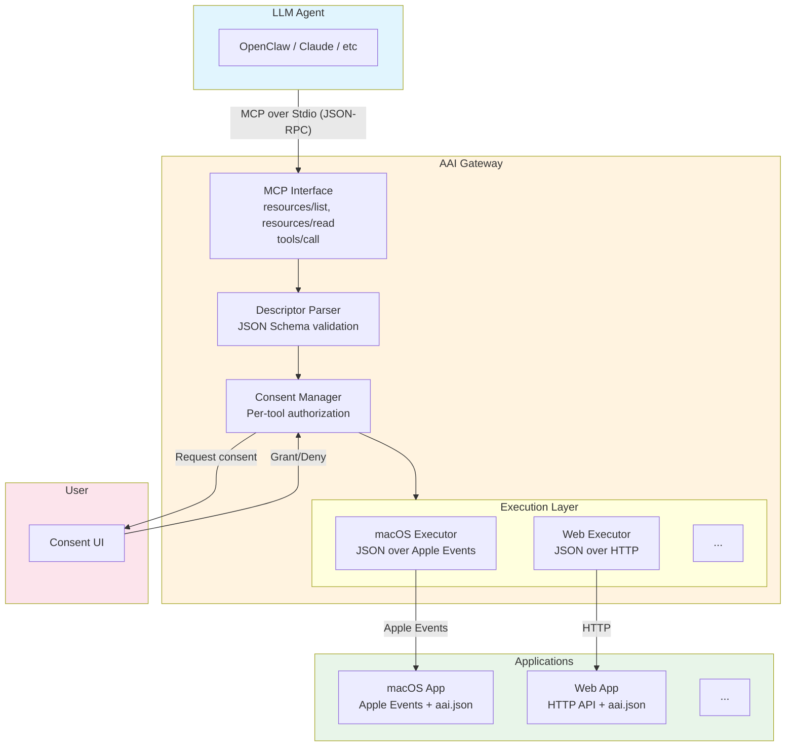

# System Architecture

## Architecture Overview



## Core Design Principles

### 1. Abstract Descriptor

`aai.json` is a **platform-agnostic descriptor** that defines capabilities using JSON Schema. See [aai.json Descriptor](/protocol/aai-json).

### 2. Two-Layer Authorization

Both layers authorize agent to access app, but protect different parties:

| Layer | Initiated By | Protects |
|-------|--------------|----------|
| **Gateway Consent** | Gateway | User from malicious apps |
| **App Authorization** | App or OS | App data from unauthorized agents |

See [Security Model](/protocol/security) for details.

### 3. Pluggable Executors

Gateway uses platform-specific executors:

| Platform | Transport | App Authorization |
|----------|-----------|-------------------|
| macOS | JSON over Apple Events | Operating System |
| web | JSON over HTTP | OAuth 2.1 |
| linux | JSON over IPC (TBD) | Operating System |
| windows | JSON over IPC (TBD) | Operating System |
| ... | ... | ... |

### 4. Progressive Discovery

Agents load tool definitions on-demand via MCP resources, avoiding context explosion.

## Data Flow

```
1. Agent → resources/list    → Gateway returns available apps
2. Agent → resources/read    → Gateway returns app descriptor
3. Agent → tools/call        → Gateway checks consent → executes → returns result
```

## Separation of Concerns

| Layer | Concern |
|-------|---------|
| **aai.json** | What the app can do (abstract) |
| **Gateway** | User consent + How to call it (platform-specific) |
| **App** | Execute the operation |

---

[Back to Protocol](/)
