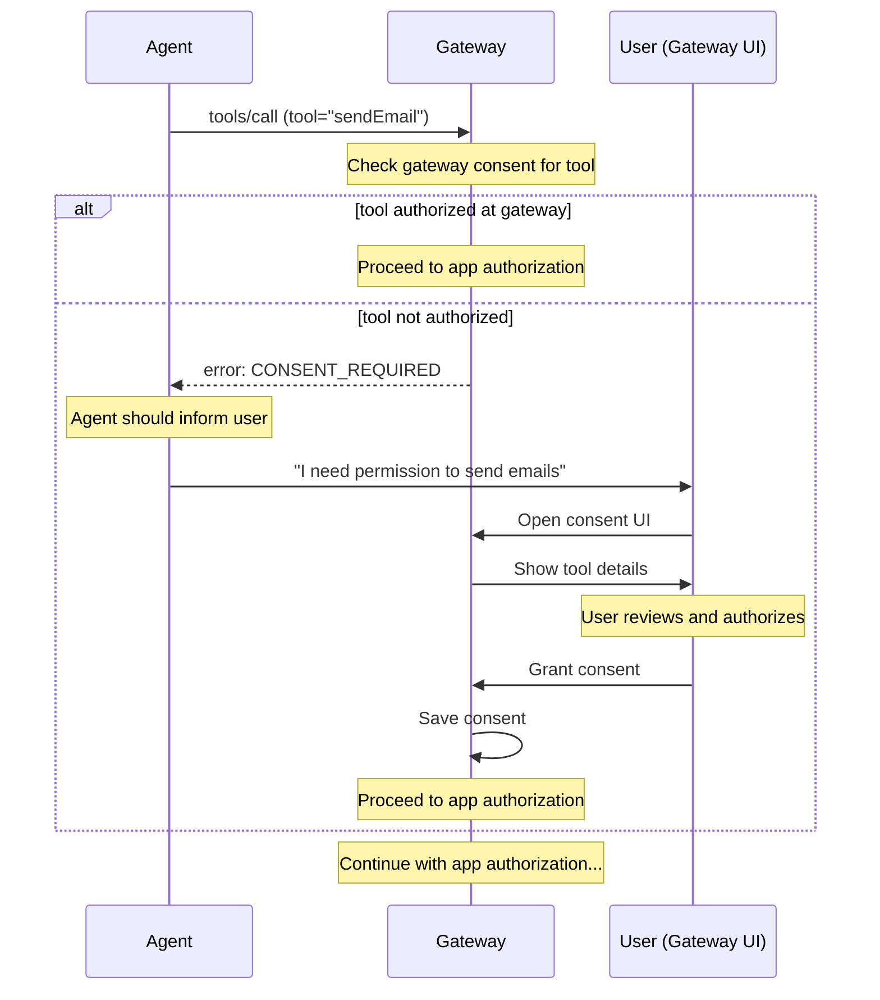
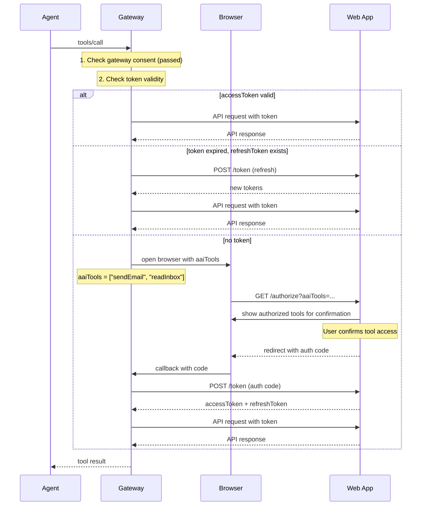
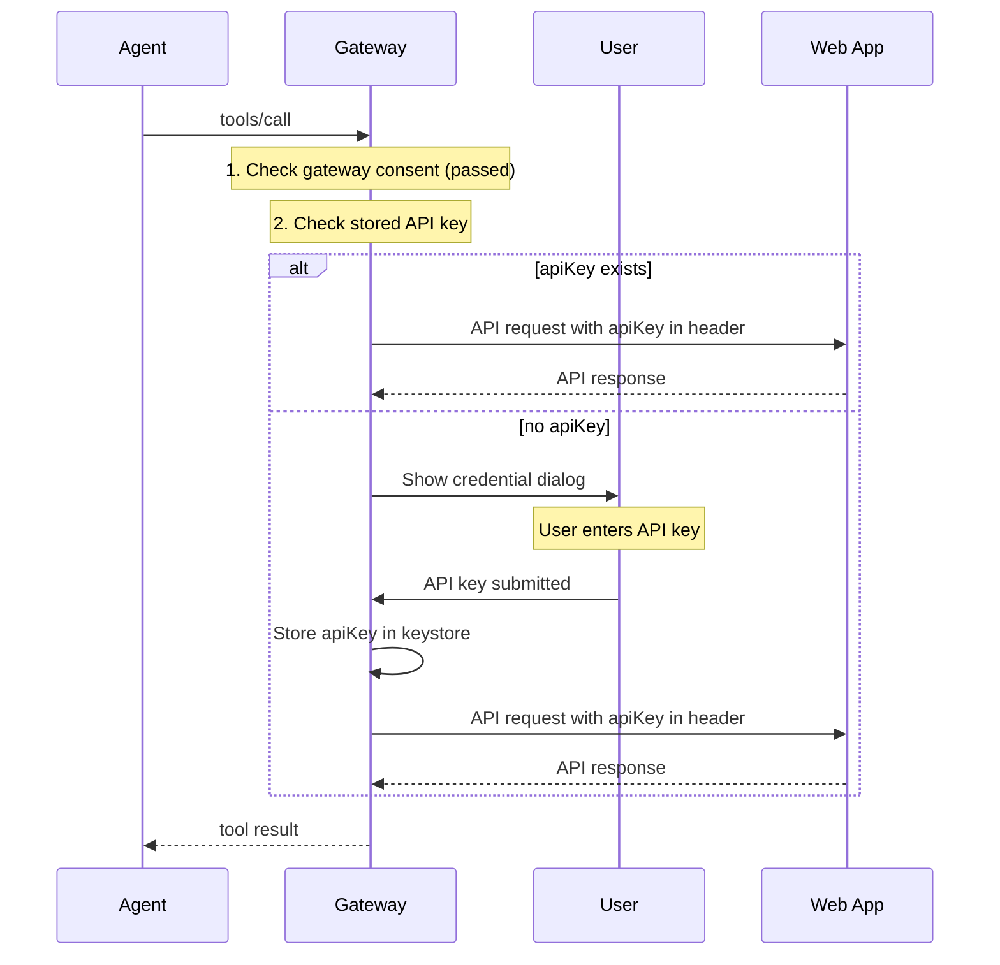
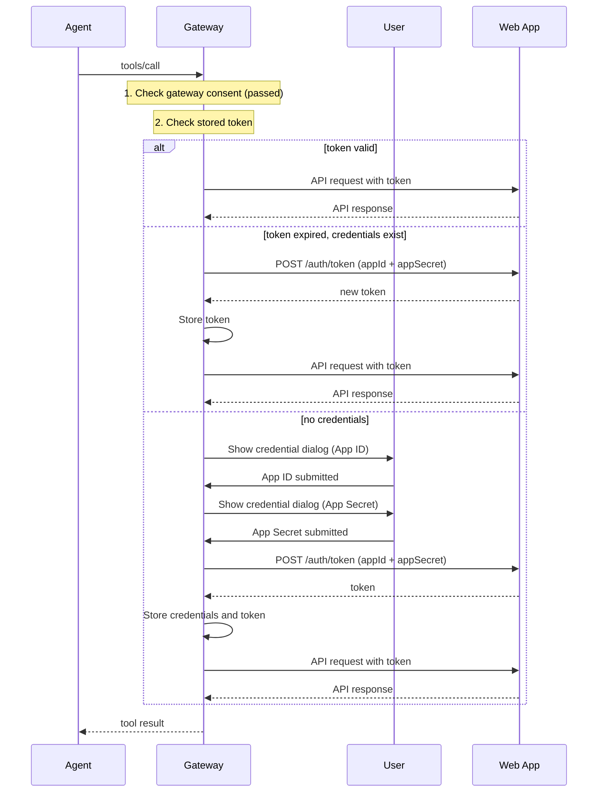
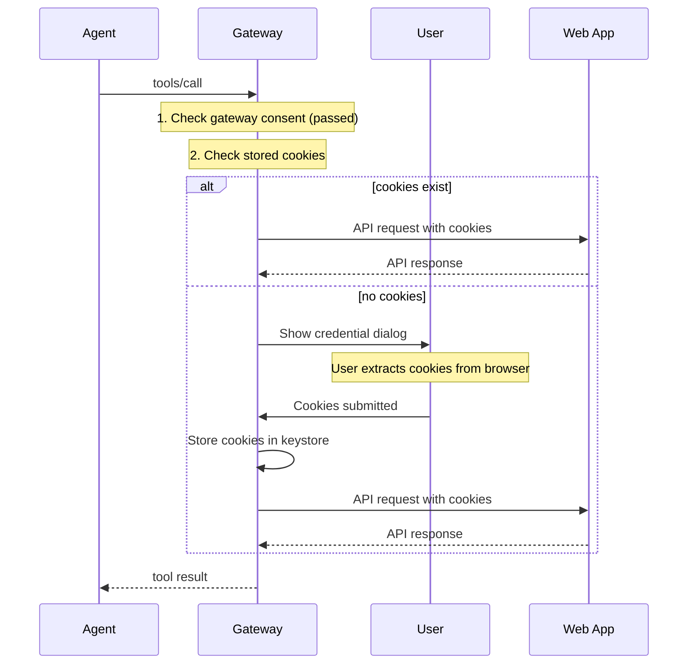

# Security Model

## Overview

Both authorization layers are about **user authorizing agent to access an app**, but with different protection goals:

| Layer                 | Initiated By | Protects Against                                  |
| --------------------- | ------------ | ------------------------------------------------- |
| **Gateway Consent**   | Gateway      | Malicious apps exposing dangerous tools to user   |
| **App Authorization** | App or OS    | Agent accessing app data without user's knowledge |

**Gateway Consent is required for ALL platforms** (macOS, web, linux, windows).

### Caller-Aware Consent

Gateway Consent is **caller-aware**, meaning consent decisions are isolated per MCP client:

- **Client Identification**: Gateway identifies which MCP client (Claude Desktop, Cursor, Windsurf, etc.) is making the request
- **Isolated Consent**: Consent granted to one client is NOT shared with other clients
- **Per-Caller Authorization**: Each MCP client must obtain its own authorization for tools
- **Clear Attribution**: Consent dialogs clearly show which client is requesting access

This prevents cross-client authorization leakage and ensures users know exactly which client is accessing which tools.
**Gateway Consent is required for ALL platforms** (macOS, web, linux, windows).

## Why Two Layers?

### Gateway Consent (Protects User from Malicious Apps)

Without Gateway consent:

- Malicious web app could expose `deleteAllFiles` tool
- Agent would call it without user awareness
- User's data destroyed

With Gateway consent:

- Gateway shows: "App X wants to expose tool: `deleteAllFiles`"
- Description: "Delete all files in user's home directory"
- User must explicitly authorize before agent can call

### App Authorization (Protects App Data from Unauthorized Agent Access)

Without App authorization:

- Agent could access user's email without app's knowledge
- User might not realize agent has full access to their data

With App authorization:

- Web app shows: "Agent X requests access to: sendEmail, readInbox"
- User confirms they trust this agent
- App knows which operations are authorized

## Caller-Aware Consent

### Concept

Gateway Consent is **caller-aware**, meaning consent decisions are isolated per MCP client:

1. **Client Identification**: Gateway identifies the MCP client from `InitializeRequest.clientInfo`
2. **Isolated Consent**: Consent is stored per `(callerName, appId, toolName)` tuple
3. **Re-authorization Required**: Different clients must obtain their own authorization
4. **Clear Attribution**: Consent dialogs show which client is requesting access

### Why Caller-Aware?

Without caller-aware consent:

- Claude Desktop authorizes `sendEmail` tool
- Cursor connects to same Gateway instance
- Cursor can use `sendEmail` WITHOUT user's knowledge (reuses Claude's consent)
- Security risk: User may not want Cursor to have same access as Claude

With caller-aware consent:

- Claude Desktop authorizes `sendEmail` tool
- Cursor connects to same Gateway instance
- Cursor tries to use `sendEmail` → Consent dialog shown: "Cursor wants to use: sendEmail"
- User explicitly authorizes Cursor (or denies)
- Consent is isolated per client

### Consent Isolation

```
Claude Desktop:
  ├─ com.example.mail
  │   ├─ sendEmail: granted
  │   └─ readInbox: granted

Cursor:
  ├─ com.example.mail
  │   └─ sendEmail: granted (separate authorization)
  │
  └─ com.example.calendar
      └─ createEvent: denied

Windsurf:
  └─ (no consents yet)
```

Each client has its own consent namespace.

### Caller Identity Source

Caller identity is extracted from MCP protocol metadata:

```typescript
interface CallerIdentity {
  name: string;        // e.g., "Claude Desktop", "Cursor", "Windsurf"
  version?: string;    // Client version if available
}

// Extracted from InitializeRequest
const callerIdentity = {
  name: request.params.clientInfo?.name ?? 'Unknown Client',
  version: request.params.clientInfo?.version,
};
```

**Fallback**: If `clientInfo` is not provided, use `"Unknown Client"` as caller name.

**Security Note**: Caller identity is informational only and not a security boundary. The real security is enforced by the operating system (TCC on macOS, UAC on Windows, etc.).

## Gateway Consent Flow



### Consent Required Error

When agent calls an unauthorized tool:

```json
{
  "error": {
    "code": "CONSENT_REQUIRED",
    "message": "User consent required for tool",
    "data": {
      "appId": "com.example.mail",
      "appName": "Example Mail",
      "tool": "sendEmail",
      "toolDescription": "Send an email on behalf of the user",
      "toolParameters": {
        "to": {
          "type": "array",
          "items": { "type": "string" },
          "description": "Recipient email addresses"
        },
        "subject": { "type": "string", "description": "Email subject line" },
        "body": { "type": "string", "description": "Email body content" }
      },
      "consentUrl": "aai://consent?app=com.example.mail&tool=sendEmail"
    }
  }
}
```

Agent should present this information to user and guide them to authorize.

## Gateway Consent UI Requirements

Gateway MUST display the following information:

### Required Information

| Field            | Source             | Description                           |
| ---------------- | ------------------ | ------------------------------------- |
| Caller Name      | MCP clientInfo     | Which MCP client is making request    |
| App Name         | `app.name`         | Which app is exposing this tool       |
| App ID           | `app.id`           | Unique identifier                     |
| Tool Name        | `tool.name`        | Tool identifier                       |
| Tool Description | `tool.description` | What the tool does                    |
| Parameters       | `tool.parameters`  | What data agent can pass to tool      |
| Returns          | `tool.returns`     | What data tool returns (if sensitive) |

### UI Example

```
┌─────────────────────────────────────────────────────────────┐
│ ⚠️  Claude Desktop requests tool access                     │
├─────────────────────────────────────────────────────────────┤
│                                                             │
│ App: Example Mail (com.example.mail)                        │
│                                                             │
│ Claude Desktop wants to use:                                │
│                                                             │
│ ┌─────────────────────────────────────────────────────────┐ │
│ │ sendEmail                                               │ │
│ │                                                         │ │
│ │ Send an email on behalf of the user                     │ │
│ │                                                         │ │
│ │ Parameters:                                             │ │
│ │ • to: Recipient email addresses                         │ │
│ │ • subject: Email subject line                           │ │
│ │ • body: Email body content                              │ │
│ │                                                         │ │
│ │ ⚠️ Claude Desktop can send emails to anyone             │ │
│ └─────────────────────────────────────────────────────────┘ │
│                                                             │
│ [Authorize Tool]  [Authorize All Tools]  [Deny]             │
│                                                             │
│ ☐ Remember this decision                                   │
│                                                             │
└─────────────────────────────────────────────────────────────┘
```

### User Choices

| Option                  | Behavior                                        |
| ----------------------- | ----------------------------------------------- |
| **Authorize Tool**      | Grant access to this specific tool only         |
| **Authorize All Tools** | Grant access to all tools from this app         |
| **Deny**                | Reject access, agent cannot use this tool       |
| **Remember**            | Persist decision, don't ask again for this tool |

## Secure Storage

**CRITICAL**: All sensitive data must be stored securely using OS-provided credential storage. Never store tokens or consent data in plaintext.

### Platform Storage APIs

| Platform | API                       | Description                                       |
| -------- | ------------------------- | ------------------------------------------------- |
| macOS    | Keychain Services         | `SecItemAdd`, `SecItemCopyMatching`               |
| Windows  | Credential Manager        | `CredWrite`, `CredRead`                           |
| Linux    | libsecret / gnome-keyring | `secret_password_store`, `secret_password_lookup` |

### What to Store Securely

| Data Type         | Storage Method           | Why                      |
| ----------------- | ------------------------ | ------------------------ |
| OAuth tokens      | Encrypted in OS keystore | Sensitive credentials    |
| Refresh tokens    | Encrypted in OS keystore | Long-lived credential    |
| API keys          | Encrypted in OS keystore | Sensitive credentials    |
| App credentials   | Encrypted in OS keystore | Sensitive credentials    |
| Consent decisions | Encrypted in OS keystore | User authorization state |

### Data Format

Data stored in keystore should be JSON-encoded then encrypted:

**Caller-Scoped Consent Storage**:

Consent decisions are nested by caller name first, then by app ID:

```json
{
  "Claude Desktop": {
    "com.example.mail": {
      "allTools": false,
      "tools": {
        "sendEmail": {
          "granted": true,
          "grantedAt": "2026-02-19T10:00:00Z",
          "remember": true
        },
        "deleteEmail": {
          "granted": false,
          "grantedAt": "2026-02-19T10:00:00Z",
          "remember": true
        }
      }
    }
  },
  "Cursor": {
    "com.example.mail": {
      "allTools": false,
      "tools": {}
    }
  }
}
```

**Key Points**:

- Each MCP client (Claude Desktop, Cursor, Windsurf, etc.) has its own consent namespace
- Consent granted to one client is NOT visible to other clients
- If `clientInfo` is not provided, use `"Unknown Client"` as the caller name
- This ensures isolation and prevents cross-client authorization leakage

### Storage Fields

| Field                              | Type    | Description                             |
| ---------------------------------- | ------- | --------------------------------------- |
| `<callerName>`                     | object  | Namespace for this MCP client           |
| `<callerName>.<appId>`             | object  | Consent for this app from this client   |
| `<callerName>.<appId>.allTools`    | boolean | User authorized all tools from this app |
| `<callerName>.<appId>.tools.<name>`| object  | Consent record for specific tool        |
| `*.granted`                        | boolean | Whether this tool is authorized         |
| `*.grantedAt`                      | string  | When consent was granted                |
| `*.remember`                       | boolean | Persist decision                        |

### Implementation Example (macOS)

```swift
import Security

func storeConsent(_ consent: Data, forCallerName callerName: String, appId: String) throws {
    let query: [String: Any] = [
        kSecClass as String: kSecClassGenericPassword,
        kSecAttrService as String: "aai-gateway",
        kSecAttrAccount as String: "consent-\(callerName)-\(appId)",
        kSecValueData as String: consent
    ]

    let status = SecItemAdd(query as CFDictionary, nil)
    guard status == errSecSuccess else {
        throw KeychainError.storeFailed
    }
}

func loadConsent(forCallerName callerName: String, appId: String) throws -> Data? {
    let query: [String: Any] = [
        kSecClass as String: kSecClassGenericPassword,
        kSecAttrService as String: "aai-gateway",
        kSecAttrAccount as String: "consent-\(callerName)-\(appId)",
        kSecReturnData as String: true
    ]

    var result: AnyObject?
    let status = SecItemCopyMatching(query as CFDictionary, &result)

    if status == errSecItemNotFound {
        return nil
    }
    guard status == errSecSuccess else {
        throw KeychainError.loadFailed
    }

    return result as? Data
}
```

**Note**: The storage key format is `consent-{callerName}-{appId}` to ensure caller-scoped isolation.

## App Authorization

After Gateway consent, the app (or OS) requires its own authorization. This protects app data from unauthorized agent access.

### Desktop (macOS)

| Layer            | Protects                          |
| ---------------- | --------------------------------- |
| Gateway Consent  | User from malicious apps          |
| OS Authorization | App data from unauthorized agents |

macOS prompts user when Gateway first calls the app via Apple Events. User approves once, OS remembers.

### Web Authentication Types

Web apps can use different authentication methods depending on their API design:

| Auth Type       | Use Case           | Description                                 |
| --------------- | ------------------ | ------------------------------------------- |
| `oauth2`        | User authorization | OAuth 2.0 with PKCE - browser-based flow    |
| `apiKey`        | Static API tokens  | Never expires (e.g., Notion, Yuque)         |
| `appCredential` | Enterprise apps    | App ID + Secret to get token (e.g., Feishu) |
| `cookie`        | No official API    | Browser session cookies (e.g., Xiaohongshu) |

### OAuth 2.0 (`oauth2`)

**Best for**: Apps that need user-specific authorization with fine-grained permissions.

| Layer             | Protects                          |
| ----------------- | --------------------------------- |
| Gateway Consent   | User from malicious apps          |
| App Authorization | App data from unauthorized agents |

**Key**: Gateway passes authorized tools to web app via `aaiTools` parameter. Web app displays this list for user confirmation—no need to implement its own tool-level consent.

#### Authorization Flow



#### Authorization Endpoint

**Request** (browser redirect):

| Parameter             | Type   | Description                                              |
| --------------------- | ------ | -------------------------------------------------------- |
| `responseType`        | string | `code`                                                   |
| `clientId`            | string | Client identifier                                        |
| `redirectUri`         | string | Callback URL                                             |
| `scope`               | string | Space-separated scopes                                   |
| `state`               | string | CSRF token                                               |
| `codeChallenge`       | string | PKCE challenge                                           |
| `codeChallengeMethod` | string | `S256`                                                   |
| `aaiTools`            | string | Comma-separated list of tools user authorized at Gateway |

Example:

```
GET /authorize?
  responseType=code&
  clientId=aai-gateway&
  redirectUri=http://localhost:3000/callback&
  scope=read%20write&
  state=xyz&
  codeChallenge=...&
  codeChallengeMethod=S256&
  aaiTools=sendEmail,readInbox,listContacts
```

**Web App UI**: Display `aaiTools` as a list for user confirmation:

```
┌─────────────────────────────────────────────────────────────┐
│ Authorize AAI Gateway                                       │
├─────────────────────────────────────────────────────────────┤
│                                                             │
│ This agent has been authorized to use:                      │
│                                                             │
│ ✓ sendEmail - Send emails on your behalf                    │
│ ✓ readInbox - Read your inbox                               │
│ ✓ listContacts - Access your contact list                   │
│                                                             │
│ Do you want to allow this agent to access your account?     │
│                                                             │
│ [Allow]  [Deny]                                             │
│                                                             │
└─────────────────────────────────────────────────────────────┘
```

**Response** (redirect):

| Parameter | Type   | Description        |
| --------- | ------ | ------------------ |
| `code`    | string | Authorization code |
| `state`   | string | Must match request |

#### Token Endpoint

**Request (authorization code)**:

```http
POST /oauth/token
Content-Type: application/x-www-form-urlencoded

grantType=authorization_code&
code=<code>&
redirectUri=<uri>&
codeVerifier=<verifier>
```

**Request (refresh token)**:

```http
POST /oauth/token
Content-Type: application/x-www-form-urlencoded

grantType=refresh_token&
refreshToken=<refreshToken>
```

**Response**:

```json
{
  "accessToken": "eyJhbG...",
  "tokenType": "Bearer",
  "expiresIn": 3600,
  "refreshToken": "dGhpcyBpcy...",
  "scope": "read write"
}
```

| Field          | Type   | Description               |
| -------------- | ------ | ------------------------- |
| `accessToken`  | string | Token for API calls       |
| `tokenType`    | string | `Bearer`                  |
| `expiresIn`    | number | Token lifetime in seconds |
| `refreshToken` | string | Token for refresh         |

### API Key (`apiKey`)

**Best for**: Services that provide static API tokens that never expire.

| Characteristic   | Description                    |
| ---------------- | ------------------------------ |
| Token lifetime   | Never expires (unless revoked) |
| User interaction | One-time input via dialog      |
| Storage          | Encrypted in OS keystore       |
| Refresh          | Not needed                     |

#### Flow



#### Credential Dialog

Gateway shows a native dialog prompting for the API key:

```
┌─────────────────────────────────────────────────────────────┐
│ 🔑 Notion Authentication                                     │
├─────────────────────────────────────────────────────────────┤
│                                                             │
│ Enter API Key for Notion                                    │
│                                                             │
│ Get your Integration Secret from Notion's My Integrations   │
│ page.                                                       │
│                                                             │
│ ┌─────────────────────────────────────────────────────────┐ │
│ │ Paste your API key here                                 │ │
│ └─────────────────────────────────────────────────────────┘ │
│                                                             │
│ [Help]  [Cancel]  [OK]                                      │
│                                                             │
└─────────────────────────────────────────────────────────────┘
```

#### Descriptor Example

```json
{
  "auth": {
    "type": "apiKey",
    "apiKey": {
      "location": "header",
      "name": "Authorization",
      "prefix": "Bearer",
      "obtainUrl": "https://www.notion.so/my-integrations",
      "instructions": {
        "short": "Get your Integration Secret from Notion",
        "helpUrl": "https://www.notion.so/my-integrations"
      }
    }
  }
}
```

#### Storage Format

```json
{
  "type": "apiKey",
  "value": "secret_...",
  "createdAt": 1700000000000
}
```

### App Credential (`appCredential`)

**Best for**: Enterprise apps that use App ID + App Secret to obtain access tokens.

| Characteristic   | Description                        |
| ---------------- | ---------------------------------- |
| Token lifetime   | Short-lived (e.g., 2 hours)        |
| User interaction | One-time input via dialog          |
| Storage          | Encrypted in OS keystore           |
| Refresh          | Automatic using stored credentials |

#### Flow



#### Credential Dialog (Two-Step)

**Step 1 - App ID:**

```
┌─────────────────────────────────────────────────────────────┐
│ 🔑 Feishu - App ID                                          │
├─────────────────────────────────────────────────────────────┤
│                                                             │
│ Enter App ID for Feishu                                     │
│                                                             │
│ Get your App ID and App Secret from Feishu Open Platform.   │
│                                                             │
│ ┌─────────────────────────────────────────────────────────┐ │
│ │                                                         │ │
│ └─────────────────────────────────────────────────────────┘ │
│                                                             │
│ [Help]  [Cancel]  [OK]                                      │
│                                                             │
└─────────────────────────────────────────────────────────────┘
```

**Step 2 - App Secret:**

```
┌─────────────────────────────────────────────────────────────┐
│ 🔐 Feishu - App Secret                                      │
├─────────────────────────────────────────────────────────────┤
│                                                             │
│ Enter App Secret for Feishu                                 │
│                                                             │
│ ┌─────────────────────────────────────────────────────────┐ │
│ │                                                         │ │
│ └─────────────────────────────────────────────────────────┘ │
│                                                             │
│ [Help]  [Cancel]  [OK]                                      │
│                                                             │
└─────────────────────────────────────────────────────────────┘
```

#### Descriptor Example

```json
{
  "auth": {
    "type": "appCredential",
    "appCredential": {
      "tokenEndpoint": "https://open.feishu.cn/open-apis/auth/v3/tenantAccessToken/internal",
      "tokenType": "tenantAccessToken",
      "expiresIn": 7200,
      "instructions": {
        "short": "Get App ID and App Secret from Feishu Open Platform",
        "helpUrl": "https://open.feishu.cn/app"
      }
    }
  }
}
```

#### Token Request

```http
POST /auth/v3/tenantAccessToken/internal
Content-Type: application/json

{
  "appId": "cli_...",
  "appSecret": "..."
}
```

**Response**:

```json
{
  "tenantAccessToken": "t-...",
  "expire": 7200
}
```

#### Storage Format

```json
{
  "type": "appCredential",
  "appId": "cli_...",
  "appSecret": "...",
  "accessToken": "t-...",
  "expiresAt": 1700007200000,
  "createdAt": 1700000000000
}
```

### Cookie (`cookie`)

**Best for**: Services without official APIs where session cookies can be used.

| Characteristic   | Description                   |
| ---------------- | ----------------------------- |
| Token lifetime   | Session-based (varies)        |
| User interaction | Manual cookie extraction      |
| Storage          | Encrypted in OS keystore      |
| Refresh          | Manual (user must re-extract) |

#### Flow



#### Credential Dialog

```
┌─────────────────────────────────────────────────────────────┐
│ 🍪 Xiaohongshu Authentication                                │
├─────────────────────────────────────────────────────────────┤
│                                                             │
│ Enter Cookies for Xiaohongshu                                │
│                                                             │
│ 1. Login to Xiaohongshu at https://xiaohongshu.com          │
│ 2. Open browser DevTools (F12)                              │
│ 3. Go to Application > Cookies                               │
│ 4. Copy the required cookies                                 │
│                                                             │
│ Required: web_session, websectiga                           │
│                                                             │
│ ┌─────────────────────────────────────────────────────────┐ │
│ │ e.g., web_session=xxx; websectiga=yyy                   │ │
│ └─────────────────────────────────────────────────────────┘ │
│                                                             │
│ [Help]  [Cancel]  [OK]                                      │
│                                                             │
└─────────────────────────────────────────────────────────────┘
```

#### Descriptor Example

```json
{
  "auth": {
    "type": "cookie",
    "cookie": {
      "loginUrl": "https://www.xiaohongshu.com",
      "requiredCookies": ["web_session", "websectiga"],
      "domain": ".xiaohongshu.com",
      "instructions": "Login in browser, then extract cookies from DevTools"
    }
  }
}
```

#### Storage Format

```json
{
  "type": "cookie",
  "value": "web_session=xxx; websectiga=yyy",
  "createdAt": 1700000000000
}
```

## Token Storage

All credentials MUST be stored securely using OS keystore:

| Platform | Storage Location                                           |
| -------- | ---------------------------------------------------------- |
| macOS    | Keychain (Service: `aai-gateway`, Account: `cred-<appId>`) |
| Windows  | Credential Manager (Target: `aai-gateway/cred/<appId>`)    |
| Linux    | libsecret (Schema: `aai-gateway`, Attribute: `appId`)      |

**Data Format** (stored encrypted):

```json
{
  "accessToken": "...",
  "refreshToken": "...",
  "expiresAt": 1700000000000,
  "tokenType": "Bearer"
}
```

**NEVER**:

- Store tokens in plaintext files
- Log tokens to console or files
- Transmit tokens over unencrypted connections

## Token Lifetime Recommendations

| Token Type           | Recommended Lifetime   |
| -------------------- | ---------------------- |
| OAuth Access Token   | 1 hour                 |
| OAuth Refresh Token  | 7 days                 |
| API Key              | Never expires          |
| App Credential Token | 2 hours (auto-refresh) |
| Cookie               | Session-based          |

---

[Back to Protocol](/)
